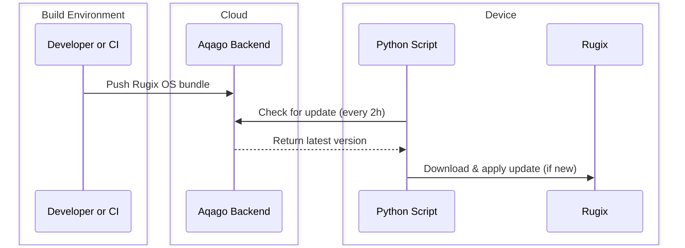

# Overview

This recipe installs a Python application that uses Aqago's authentication and
content storage features to implement basic system update management to
[Rugix](https://oss.silitics.com/rugix).

The application runs periodically to check the Aqago backend for a new system
(OS) image. If a new image is available, it passes the URL to `rugix-ctrl` for
download, verification, and installation.

## Setup

### Add the Rugix recipe to your Rugix project

To add the application to your Rugix project include this repository as an
external repository in `rugix-bakery.toml`, then add the recipe to your layer's
`toml` file.

### Provision supporting infrastructure in the Aqago backend

To provision the application's supporting infrastructure in the Aqago backend,
run the included `aqago-infra.sh` bash script. Note you must configure the
`aqago-cli` via `aqago-cli configure` before running the script.

## Operation

The Rugix recipe installs the application and registers it as a `systemd`
service triggered by a `systemd` timer. The timer triggers the service every two
hours. This can be modified in the timer file.

By default, Rugix will reboot the system after a new OS image is installed.
